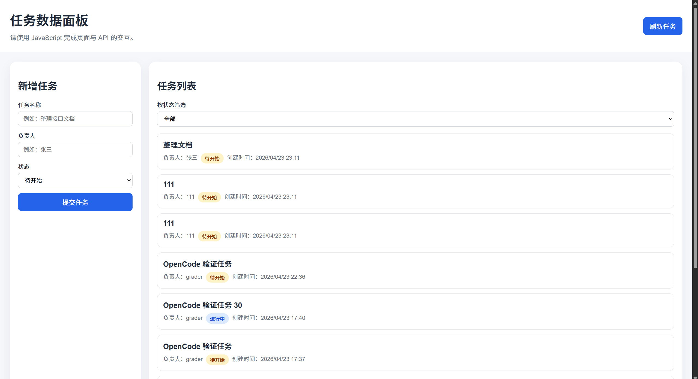

# JS与API的交互与数据渲染

## 项目简介

这是一个使用 JavaScript 完成 API 交互与数据渲染的任务面板页面。

## 我完成的功能

- 获取任务列表
- 渲染任务列表
- 提交新任务
- 按状态筛选任务
- 错误提示

## 我的实现思路

### 1. 页面加载

调用 loadTasks() 方法，从 API 获取任务数据并完成首次渲染，实现页面打开即展示任务列表的效果。

### 2. 获取和渲染数据

- fetchTasks()
    - 向后端 API 发送请求，获取任务列表数据。
    - 支持容错处理：自动兼容接口返回的「数组」或「对象嵌套数据」两种格式，避免因数据结构不统一导致报错。
- renderTasks()
    - 根据筛选条件（状态筛选）动态生成任务列表，渲染到页面。
    - 多层容错保障：
        - 空数据 / 无匹配数据时，显示「暂无任务」提示；
        - 字段缺失时（如 title/owner/status 不存在），自动使用默认值，避免页面崩溃；
        - 状态字段兼容处理，自动映射为「待开始 / 进行中 / 已完成」三种展示文本。

### 3. 提交任务

- 事件绑定：为提交表单绑定 submit 事件，通过 e.preventDefault() 阻止表单默认刷新行为。
- 数据校验：提交前校验表单必填项（标题、负责人），为空时给出错误提示。
- 提交与反馈：
    - 调用 createTask() 方法发送 POST 请求提交新任务；
    - 提交成功后显示「提交成功」提示，并自动刷新任务列表；
    - 提交失败时捕获错误并展示异常信息，提升用户体验。
### 4. 状态筛选

切换筛选框时，重新请求获取符合筛选条件的任务数据，并且自动刷新实时更新；也可手动刷新任务列表。

## 页面截图

